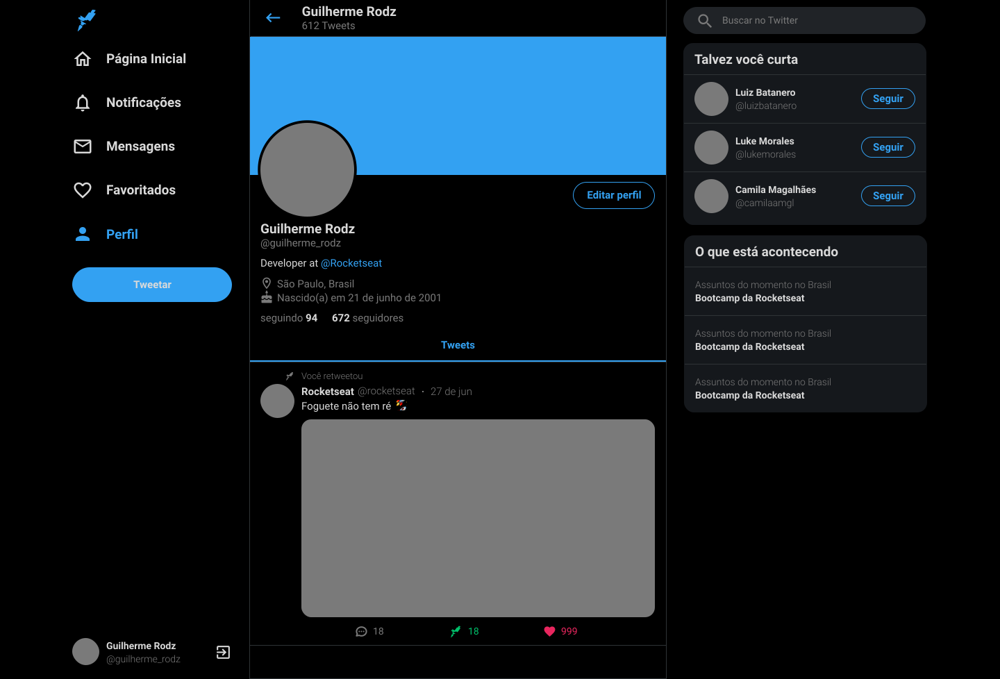
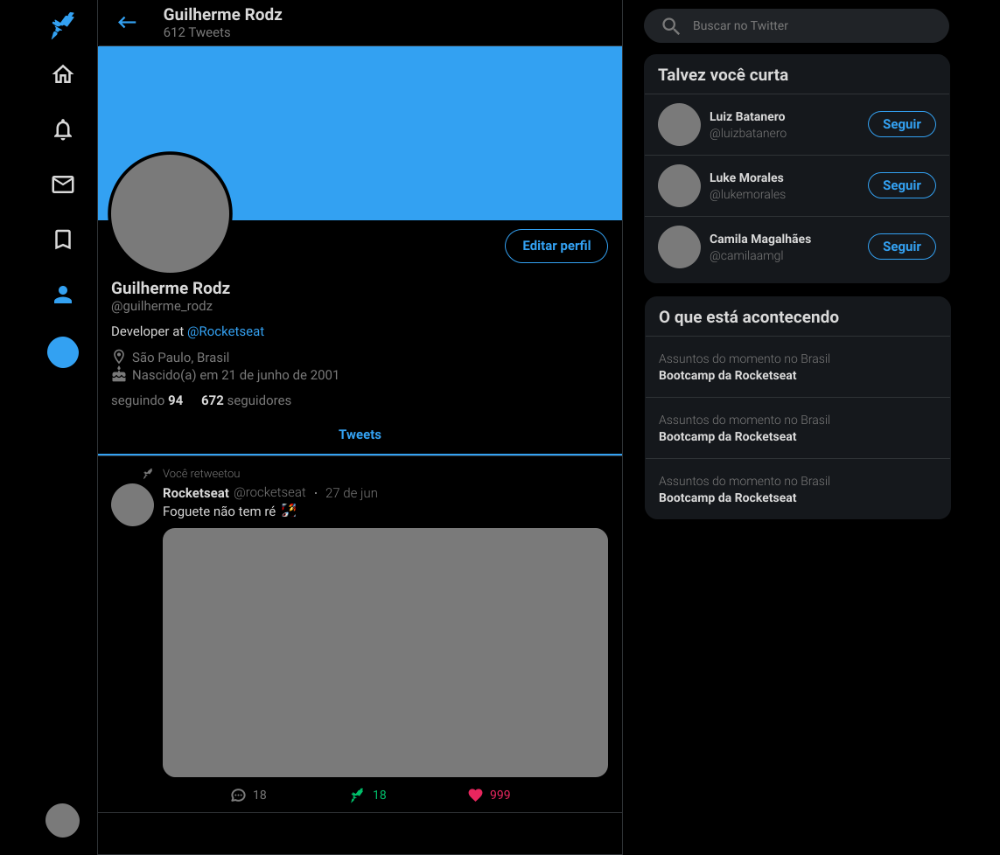

# Clone UI Twitter 💜

&nbsp;

<p align="center">Feito com 💙 <br/>Hugo Alves Varella</p>

### 🔗 Link para o projeto online

[Clone Twitter](https://clone-interface-twitter.vercel.app/)

&nbsp;

<div align="center">
  
  
  
</div>

<br/>

## 📚 Informações sobre o projeto

- Esse projeto foi desenvolvido durante uma Aula do Guilherme Rodz, na plataforma youtube no canal da Rocketseat

&nbsp;

## 💻 O que tem no projeto?

- Clone da interface do twitter, Responsivo.

&nbsp;

## 🔖 Layout

Você pode visualizar o layout do projeto através [desse link](https://www.figma.com/file/cjNh1bd93pbJBFOza25K7L/Twitter-Clone?node-id=1%3A2). É necessário ter conta no [Figma](http://figma.com/) para acessá-lo.

&nbsp;

## 🛠️ Tecnologias/Ferramentas ultilizadas

- [React](https://pt-br.reactjs.org/E)
- [TypeScript](https://www.typescriptlang.org/)
- [styled-components](https://styled-components.com/)
- [react-sticky-box](https://react-sticky-box.codecks.io/)

## ⚙️ Instalação

```
# Abra um terminal e copie este repositório com o comando
$ git clone https://github.com/Hugovarellaa/clone-interface-twitter
```

```
# Acesse a pasta da aplicação
$ cd clone-interface-twitter

# Instale as dependências
$ yarn

# Inicie a aplicação
$ yarn start

```

---
